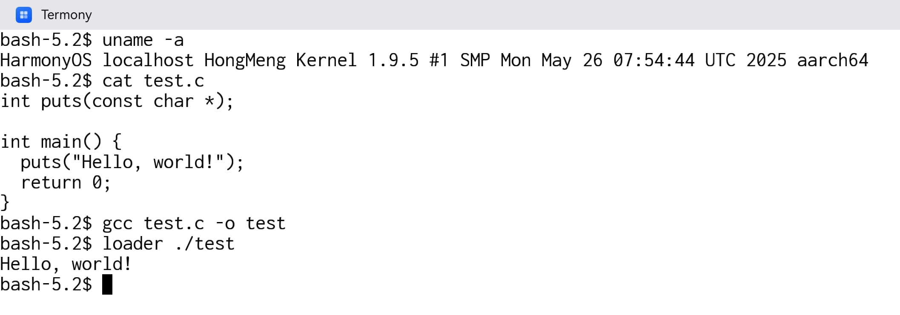

# Termony

[GitHub](https://github.com/jiegec/Termony) [Gitee](https://gitee.com/jiegec/Termony)

Termux for HarmonyOS Computer. Working in Progress.

It can run some basic commands on Huawei MateBook Pro now:


Also compile and run C/C++ programs on HarmonyOS Computer:



## Overview

Bundled packages:

- bash
- binutils
- busybox
- c-ares
- coremark
- curl
- [elf-loader](https://github.com/MikhailProg/elf) (you can run executable without executable permission! e.g. `cp /data/app/bin/bash ~/ && loader ~/bash`)
- fastfetch
- fish
- gcc
- gmp
- htop
- kbd
- libevent
- libidn2
- libunistring
- lz4
- make
- mpc
- mpfr
- ncnn
- ncurses
- openssh
- openssl
- pcre2
- readline
- sl
- strace
- stream
- tar
- tmux
- tree
- vim
- vkpeak
- xxhash
- yyjson
- zstd

Pro tip: you can use these utilities in the builtin Terminal app under `/data/service/hnp`, although some paths might get wrong due to prefix set to `/data/app/base.org/base_1.0` (thanks to @duskmoon314). You can override them like:

```shell
LD_LIBRARY_PATH=/data/service/hnp/base.org/base_1.0/lib TERMINFO=/data/service/hnp/base.org/base_1.0/share/terminfo fish
```

You can persist them to `~/.bashrc`, and run bash before executing other commands from Termony:

```shell
export LD_LIBRARY_PATH=/data/service/hnp/base.org/base_1.0/lib
export TERMINFO=/data/service/hnp/base.org/base_1.0/share/terminfo
export VIM=/data/service/hnp/base.org/base_1.0/share/vim
export TMUX_TMPDIR=/data/storage/el2/base/cache
```

However, the builtin Terminal app does not have the permission to map R+X pages, so you cannot use elf loader there. You can use it in Termony.

Terminal features:

- Basic escape sequence support
- Paste via context menu (right-click to activate)
- Copy/paste in command line via pbcopy/pbpaste using OSC52 escape sequence

## Usage (if you are a Mac user):

1. Connect your MateBook Pro to Mac, and do the following steps on Mac
2. Clone this repo recursively, and cd into this repo
3. Setup code signing in DevEco-Studio, ignore warnings if any
4. Install `wget`, `coreutils` `make` `gsed` and `ncurses` from homebrew
5. (M-series User) `export PATH="/opt/homebrew/opt/coreutils/libexec/gnubin:/opt/homebrew/opt/gnu-sed/libexec/gnubin:/opt/homebrew/opt/make/libexec/gnubin:$PATH"`
6. Run `./create-hnp.sh` to create hnp packages
7. Run `./build-macos.sh`
8. Run `./push.sh ./entry/build/default/outputs/default/entry-default-signed.hap`
9. Input command in the text input of the application, press enter

## Usage (if you are a Linux user):

1. Connect your MateBook Pro to a Linux machine, and do the following steps
2. Clone this repo recursively, and cd into this repo
3. Setup code signing in DevEco-Studio, ignore warnings if any
4. Setup DevEco Command Line Tools, and make sure `$TOOL_HOME` env var is a correct directory to SDK
5. Run `./build-linux.sh -b` to create hnp packages
6. Run `./build-linux.sh -s` to signing
7. Run `./build-linux.sh -p`
8. Input command in the text input of the application, press enter

## How does it work

By examining CodeArts IDE, we found that it utilizes HNP packages for native programs. You need to package `.hnp` files into the `.hap`, and add them to `module.json5` like:

```json5
{
  "module": {
    "hnpPackages": [
      {
        "package": "busybox.hnp",
        "type": "private"
      }
    ]
  }
}
```

Then, you need to add the `.hnp` files to `.hap` and sign the `.hap` manually. You can refer to `sign.py` to see how it is done. The `.hnp` packages are unpacked under `/data/app` automatically and symlinks are created under `/data/app/bin`.
